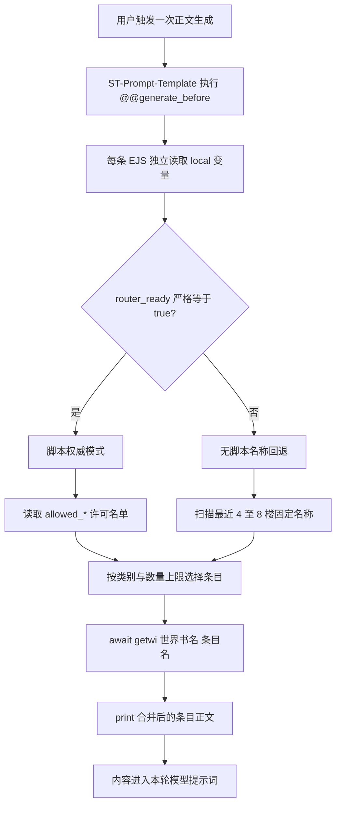

# 灵力复苏地球附属世界书：EJS 运行与脚本联动技术文档

## 1. 文档范围

本文描述 `灵力复苏地球附属世界书.json` 当前版本的实际运行逻辑，覆盖：

- SillyTavern 与 ST-Prompt-Template 的运行依赖；
- 10 条 EJS 路由的执行时机、职责和装载上限；
- `daoyuan_earth.router_ready` 控制的脚本模式与无脚本模式；
- 本地脚本、可选独立推演 API、EJS 和普通世界书条目的权威边界；
- `getvar`、`matchChatMessages`、`getwi` 和 `print` 的使用方式；
- 故障降级、性能边界、验证方法和维护注意事项。

本文不描述尚未实现的后台推演算法，也不把独立推演 API 视为世界书运行的必需条件。

## 2. 当前实现与运行依赖

### 2.1 产物和源码

| 资源 | 作用 |
| --- | --- |
| `灵力复苏地球附属世界书.json` | 用户导入 SillyTavern 的正式世界书 |
| `生成世界书.mjs` | 生成 187 条世界书条目和 10 条 EJS 路由 |
| `创作规划.yaml` | 项目级设计事实与路由契约 |
| `脚本控制契约.md` | 本地脚本、API 与 EJS 的职责边界 |
| `地球NPC数据.mjs` 等数据文件 | 固定 NPC、城市和其他条目的结构化来源 |

正式世界书不是手工维护的权威源。修改路由或条目后，应修改生成源并重新运行 `生成世界书.mjs`。

### 2.2 运行依赖

| 依赖 | 类型 | 是否必需 | 当前核验版本 |
| --- | --- | --- | --- |
| SillyTavern | 宿主程序 | 是 | 1.18.0 |
| ST-Prompt-Template | 本地第三方扩展 | 是 | manifest 1.17.6.8，源码提交 `c80a572839f99a2aaf3d91cf9b7ebfc202c4ef0b` |
| 道渊小手机本地脚本 | 本地可选组件 | 否 | 未安装时使用 EJS 名称回退 |
| 独立世界推演 API | 远程可选组件 | 否 | 只为后台世界演化提供候选补丁，不参与基础条目读取 |

无脚本模式不产生独立推演 API 费用，但仍需要 ST-Prompt-Template 执行 EJS。

## 3. 世界书结构

当前正式产物共 187 条：

- 1 条常驻监控：`双界基准监控`；
- 176 条普通资料：世界观、国家、学校、组织、势力、人物接口、72 名固定 NPC、30 个城市节点等；
- 10 条 EJS 路由。

普通资料条目具有以下共同特征：

- `disable: true`；
- 主要关键字 `key: []`；
- 不依靠 SillyTavern 原生绿灯关键词激活；
- 由 EJS 使用 `getwi()` 精确读取。

EJS 条目同样保持关闭状态，但内容首部同时声明：

```text
@@generate_before
@@always_enabled
```

`@@generate_before` 使路由在模型生成前执行；`@@always_enabled` 使特殊条目不受普通启用状态和兼容模式差异影响。

## 4. 总体运行架构



EJS 只决定本轮提示词装载什么。EJS 不负责写入世界状态、推进日期、确认事件或调用远程 API。

## 5. EJS 执行模型

### 5.1 独立执行

10 条 EJS 条目分别由 ST-Prompt-Template 求值。每条路由都会重新声明自己的局部常量，不依赖 `EJS预处理` 先执行，也不依赖另一条 EJS 泄漏变量。

生成器中的 `earthRouteContext` 会被嵌入每条主要路由，提供相同的读取逻辑：

```js
const twEarthRouterReady =
  getvar('daoyuan_earth.router_ready', {
    scope: 'local',
    defaults: false,
  }) === true;
```

严格比较 `=== true` 是权威门。变量不存在、`null`、空字符串或字符串 `"true"` 都不会进入脚本模式。

### 5.2 异步 EJS

当前 ST-Prompt-Template 使用异步 EJS 编译，因此路由可以在代码块中执行：

```js
const value = await getwi(twEarthBook, name);
```

`print()` 是 EJS 输出函数。路由将多个条目正文放入数组，过滤空值后用换行连接，再通过 `print()` 写入当前提示词位置。

### 5.3 世界书名

路由读取：

```js
getvar('daoyuan_earth.worldbook_name', {
  scope: 'local',
  defaults: '灵力复苏地球附属世界书',
});
```

随后始终使用显式世界书名调用 `getwi(twEarthBook, entryName)`。世界书被用户改名而变量未同步时，动态读取可能返回空内容。

## 6. 双轨权威判定

### 6.1 脚本权威模式

进入条件：

```text
daoyuan_earth.router_ready === true
```

该模式下：

- 当前世界必须由 `daoyuan_earth.current_world` 明确标记为 `地球`；
- NPC、城市、组织、玄天界势力和原版人物接口由 `allowed_*` 名单决定；
- 最近聊天里出现一个名称，不能绕过脚本名单；
- 脚本名单为空意味着该类别本轮不装载；
- EJS 不根据聊天内容修改名单或持久状态。

例如：

```yaml
daoyuan_earth.router_ready: true
daoyuan_earth.current_world: 地球
daoyuan_earth.allowed_npcs:
  - 顾承岳
```

即使最近消息出现“沈砚秋”，本轮 NPC 路由仍只允许读取 `顾承岳人物档案`。

### 6.2 无脚本兼容模式

进入条件：`router_ready` 不严格等于 `true`。

该模式下，EJS 使用 `matchChatMessages()` 扫描最近消息：

```js
matchChatMessages([name], { start: -8 });
```

固定 NPC、组织、城市和势力使用完整名称字符串作为白名单。匹配语义是“消息包含该完整字符串”，不是中文分词意义上的整词边界。

例如：

- `沈砚秋进入会议室` 可以匹配 `沈砚秋`；
- `沈主任进入会议室` 不会匹配，除非后续把该别名加入白名单；
- 名称匹配只影响当前生成，不会记录“已认识沈砚秋”。

无脚本模式不会调用独立推演 API，也不会把聊天里的名称升级为永久接触关系。

## 7. 路由变量

### 7.1 核心变量

| 变量 | 类型 | 默认值 | 用途 |
| --- | --- | --- | --- |
| `daoyuan_earth.router_ready` | boolean | `false` | 脚本权威门 |
| `daoyuan_earth.current_world` | string | `自动判断` | 当前是否处于地球剧情 |
| `daoyuan_earth.region` | string | 空字符串 | 国家、学校和地区辅助判断 |
| `daoyuan_earth.worldbook_name` | string | 正式世界书名 | `getwi` 的目标世界书 |
| `daoyuan_earth.swarm_threat` | string | `无` | 虫群路由状态条件 |

### 7.2 许可名单

| 变量 | 单轮截断 | 消费路由 |
| --- | ---: | --- |
| `allowed_countries` | 2 | 国家学校路由 |
| `allowed_schools` | 2 | 国家学校路由 |
| `allowed_organizations` | 4 | 地球组织路由 |
| `allowed_sects` | 3 | 玄天界势力路由 |
| `allowed_characters` | 3 | 原版人物地球接口路由 |
| `allowed_npcs` | 4 | 地球固定 NPC 路由 |
| `allowed_cities` | 3 | 城市节点路由 |

`factions` 和 `characters` 保留为旧脚本兼容输入；新脚本应优先写入明确分类的 `allowed_*` 字段。

名单可以是数组，也可以是使用中文逗号、英文逗号或竖线分隔的字符串。EJS 会先标准化为数组，再执行截断。

## 8. 十条 EJS 路由

| 路由 | order | 脚本模式 | 无脚本模式 | 上限或输出 |
| --- | ---: | --- | --- | --- |
| EJS预处理 | 200 | 读取并 `define` 公共值 | 提供安全默认值 | 不输出正文 |
| EJS地球基础路由 | 190 | `current_world=地球` | 地球短语或任一已知实体全名 | 固定装载 10 条基础规则 |
| EJS国家学校路由 | 180 | 地区、国家、学校许可 | 最近 8 楼国家或学校别名 | 最多 2 组，并附教育体系 |
| EJS地球组织路由 | 170 | 组织许可名单 | 最近 8 楼组织全名 | 最多 4 个 |
| EJS玄天界势力路由 | 160 | 宗门许可名单 | 最近 8 楼势力全名 | 最多 3 个地球策略 |
| EJS女性人物路由 | 150 | 原版人物许可名单 | 最近 8 楼人物全名 | 最多 3 个人物接口 |
| EJS城市节点路由 | 147 | 城市许可名单 | 最近 8 楼城市或节点全名 | 最多 3 个 |
| EJS地球NPC路由 | 145 | 固定 NPC 许可名单 | 最近 8 楼固定姓名 | 最多 4 人；命中时附临时 NPC 规则 |
| EJS虫群路由 | 140 | 虫群威胁或聊天命中 | 虫群关键词命中 | 固定装载 3 条虫群规则 |
| EJS货币路由 | 130 | 地球上下文加交易命中 | 地球上下文加交易命中 | 固定装载 4 条货币规则 |

条目 `order` 表示世界书侧的排序意图，但各路由不得依赖其他路由已经执行或已经定义变量。

## 9. 基础路由联动

无脚本模式下，如果最近聊天直接出现某个固定 NPC、城市、组织、玄天界势力或原版人物名称，基础路由也会启动。这样可以避免只装载人物档案，却缺少地球世界规则。

基础路由固定读取：

1. 地球篇总纲；
2. 灵力复苏开局与时间基准；
3. 双界接触阶段；
4. 相交秘境与跨界规则；
5. 地球天道跨界压制；
6. 开放世界与玩家边界；
7. 地球统一阶位与 DC 换算；
8. 修炼与外貌年龄规则；
9. 现代武器与超凡目标判定；
10. 地球开放局势。

这 10 条是固定成本。具体 NPC、城市和组织在此基础上按需增加。

## 10. 本地脚本联动

### 10.1 本地脚本职责

本地脚本是已确认世界状态的唯一写入者，负责：

- 初始化 `router_ready`；
- 维护当前世界、地区、日期、复苏阶段和双界接触阶段；
- 维护本轮许可名单；
- 清理过期场景许可；
- 区分聊天提及与已经确认的剧情事实；
- 在需要时组织独立 API 的候选推演，但不接受未经校验的散文结果。

脚本不应把 176 条普通资料全部改成常驻，也不应绕过 EJS 的单轮装载上限。

### 10.2 推荐初始化顺序

```text
1. 建立当前聊天的本地状态
2. router_ready 保持 false
3. 写入 current_world、worldbook_name 和各 allowed_* 初始值
4. 完成世界书存在性与变量可读性检查
5. 最后写入 router_ready = true
```

最后写入 `router_ready` 可以避免 EJS 在半初始化状态进入脚本模式。

### 10.3 场景更新顺序

```text
剧情产生可观察结果
  → 本地脚本判断是否构成已确认事实
  → 更新当前世界、地区和许可名单
  → 下一次生成时 EJS 读取新名单
  → getwi 装载本轮相关资料
```

聊天正文中的名称不能直接写入永久名单。脚本应依据真实接触、调查、事件结果或用户操作决定是否更新。

## 11. 独立推演 API 联动

独立 API 位于 EJS 之前，且完全可选：


独立 API：

- 不直接访问酒馆变量；
- 不直接写世界书；
- 不直接调用 `getwi`；
- 不替玩家生成行动、台词和立场；
- 只返回候选状态补丁；
- API 失败时保留最后一次已确认状态。

没有 API 时，本地脚本仍可使用确定性状态和人工许可名单；没有本地脚本时，EJS 退回即时名称匹配。

## 12. `getwi` 装载行为

调用形式：

```js
await getwi(twEarthBook, '沈砚秋人物档案');
```

当前插件实现会：

1. 按世界书名和条目标题查找条目；
2. 读取条目正文，即使该普通条目处于关闭状态；
3. 对被读取正文再次执行正则、宏和 EJS 处理；
4. 返回字符串；
5. 找不到条目时记录警告并返回空字符串。

`getwi` 绕过普通绿灯关键词激活，因此主要关键字可以留空。代价是所有名称、标题和世界书名必须保持一致。

## 13. 故障与降级

| 故障 | 当前行为 |
| --- | --- |
| 未安装本地脚本 | `router_ready=false`，使用最近消息名称回退 |
| 独立 API 不可用 | 不影响 EJS；保留最后确认状态，不生成新的后台重大事件 |
| ST-Prompt-Template 未安装或关闭 | EJS 不执行，除常驻监控外的关闭条目不会动态装载 |
| `getwi` 不存在 | 基础路由输出诊断，其他路由不读取资料 |
| 世界书被改名 | 默认世界书名可能找不到条目；脚本应同步写入 `worldbook_name` |
| `router_ready=true` 但 `current_world` 未设置为地球 | 脚本模式路由不会进入地球正文装载 |
| 许可名单名称与条目标题不一致 | 对应条目不装载，不进行模糊纠正 |
| 无脚本模式使用简称 | 不匹配，除非简称被显式加入路由别名 |

## 14. 性能和上下文预算

路由通过上限控制一次生成的资料量：

- 固定 NPC 最多 4 人；
- 城市最多 3 个；
- 组织最多 4 个；
- 玄天界势力最多 3 个；
- 原版人物接口最多 3 个；
- 国家和学校最多 2 组。

当同类命中超过上限时，当前实现按生成源中的名单顺序取前几个，不按聊天中最后出现的顺序排序。修改名单顺序会改变超限时的优先结果。

NPC 档案在 `cl100k_base` 参考编码下每人约 1558 至 1694 token，平均约 1627 token。无脚本模式同时命中 4 人时会产生明显上下文成本，因此不应提高上限而不做性能测量。

### 14.1 静态 token 测量口径

本节测量对象为正式世界书 `灵力复苏地球附属世界书.json`，SHA-256 为 `b2193e65f92550aba80ce6ea9551078b7c83d38ac4aa10ec93d04b814e7d9776`。统计的是路由最终输出的世界书正文，不把 EJS 源代码本身计入模型提示词；EJS 在本地渲染时的计算开销也不属于模型 token。

为了避免把某一家模型的 tokenizer 当成通用标准，同时给出两种 OpenAI 参考编码：`o200k_base` 和 `cl100k_base`。Claude、Gemini及本地模型的实际计数会有差异，最终账单应以目标 API 的 tokenizer 或真实请求日志为准。

| 场景 | 进入提示词的条目数 | 字符数 | `o200k_base` | `cl100k_base` | 相对非 EJS 全量常驻的节省 |
| --- | ---: | ---: | ---: | ---: | ---: |
| 177 条非 EJS 内容全部进入提示词 | 177 | 139073 | 107022 | 159944 | 基线 |
| 仅基础路由与常驻监控 | 11 | 6469 | 4986 | 7258 | 约 95.5% |
| 典型单 NPC：基础路由、临时 NPC 规则、1 份人物档案 | 13 | 8874 | 6788 | 9956 | 约 93.7%–93.8% |
| NPC 达到 4 人上限 | 16 | 13166 | 10147 | 14931 | 约 90.5%–90.7% |
| 所有类别同时达到当前路由上限 | 41 | 21151 | 16272 | 24250 | 约 84.8% |

因此，按当前世界书最常见的“基础资料 + 1 名 NPC”估算，一次生成相对全量常驻可少发送约 100234 个 `o200k_base` token，或约 149988 个 `cl100k_base` token。这个数字是单次提示词差值，不是对整段聊天累计账单的保证；聊天历史、角色卡、系统提示词和模型回复仍会另外占用 token。

### 14.2 与原生世界书关键词触发的正确比较

比较必须以“最终装载了哪些正文条目”为准，而不能仅以触发技术命名方案：

- 原生关键词和 EJS 若装载完全相同的条目，主聊天世界书 token 相同；
- EJS 只在阻止原生关键词的历史误触发、递归级联或过量常驻时产生正文节省；
- 177 条非 EJS 内容全量常驻仅用于表示极端上界，不代表配置合理的原生蓝绿灯；
- 静态 tokenizer 只能判断数量级，最终验收仍应捕获同一输入下的真实 prompt，并用目标模型 tokenizer 比较世界书注入段。

### 14.3 明确场景与历史记录残留的对照

本节只统计主聊天生成时收到的世界书正文，不统计预设、聊天正文、角色卡其他字段、模型回复，也不统计脚本推演自身可能产生的 API 输入和输出 token。

测试当前消息：

```text
我通过传送门前往地球，然后用神识扫了一下周围，发现这里是中国境内，并有灵力的痕迹，但是还很微弱。
```

无脚本 EJS 回退会以“前往地球”启动地球基础路由，并以“中国”启动国家和学校路由；“传送门”“神识”“灵力微弱”不会额外打开 NPC、城市、组织、玄天界势力、虫群或货币路由。若脚本正确写入：

```yaml
router_ready: true
current_world: 地球
region: 中国
phase: 局部复苏
allowed_npcs: []
allowed_cities: []
allowed_organizations: []
```

三种等价配置最终都装载 14 条正文：1 条常驻监控、10 条地球基础资料，以及 `地球灵力教育体系`、`中国超凡体系`、`中国综合修真大学体系`。

| 方案 | 条目数 | 字符数 | `o200k_base` | `cl100k_base` |
| --- | ---: | ---: | ---: | ---: |
| 配置准确的原生蓝灯与绿灯 | 14 | 7796 | 6006 | 8927 |
| 无脚本 EJS 回退 | 14 | 7796 | 6006 | 8927 |
| 有脚本的 EJS 权威路由 | 14 | 7796 | 6006 | 8927 |

因此，在当前消息明确、历史没有造成额外命中、三种方案最终装载相同条目的前提下，有无脚本以及是否使用 EJS 都不会改变主聊天的世界书 token。推演变量和 EJS 源代码本身不会作为世界书正文原样发送给主聊天模型。

真正产生差异的是扫描范围内的历史记录。例如最近 8 条消息曾经出现沈砚秋、顾承岳、陆清锋和伊芙琳·哈特，但四人都不在当前中国落点场景：

- 配置相近的原生绿色关键词可能继续命中历史中的四个人物；实际结果取决于其 Scan Depth、递归和关键词配置。
- 当前无脚本 EJS 使用 `matchChatMessages(..., { start: -8 })` 检查人物、城市、国家、组织和势力名称，因此也会把这四名历史人物视为有效命中，并受 NPC 上限限制装载前 4 人。
- 当 `router_ready=true` 时，固定 NPC 路由改用 `allowed_npcs` 作为权威名单；若脚本根据当前场景写入空名单，历史人物名称不再触发人物档案。

按上述四名历史 NPC 计算：

| 场景 | 条目数 | `o200k_base` | `cl100k_base` |
| --- | ---: | ---: | ---: |
| 无历史误触发，或脚本确认当前无 NPC | 14 | 6006 | 8927 |
| 最近 8 条历史命中 4 名 NPC，另附临时 NPC 生成规则 | 19 | 11167 | 16600 |
| 脚本权威路由少注入 | 5 | 5161 | 7673 |

在这个历史残留案例中，脚本权威路由只就主聊天世界书正文减少约 46.2%。这不是固定节省率：历史中命中的人物、城市、组织数量和条目长度不同，结果会随之变化。

脚本权威模式也并非完全停止读取聊天历史。当前实现仍保留以下直接文本检查：

- 临时 NPC 泛称扫描最近 4 条，例如“路人”“群众”“工作人员”；
- 虫群关键词扫描最近 8 条；
- 货币和交易关键词扫描最近 5 条。

所以即使 `router_ready=true`，这些词若残留在对应窗口内，仍可能装载临时 NPC、虫群或货币资料。脚本对固定 NPC、城市、国家、学校、组织、宗门和原版人物接口具有权威控制，但尚未完全接管上述三个特殊路由。

另需区分当前正式文件与“原生蓝绿灯对照模型”：当前 JSON 的普通资料条目没有原生关键词并处于关闭状态；若完全没有 EJS 支持，文件实际只会注入 `双界基准监控`，约为 682 个 `o200k_base` token 或 977 个 `cl100k_base` token。这个结果缺少必要设定，不能视为与14条完整路由等价的节省。表中的“原生蓝绿灯”是指为相同资料配置了准确常驻项和关键词后的功能等价对照。

### 14.4 原生蓝绿灯与 EJS 的客观结论

| 维度 | 原生蓝绿灯关键词 | EJS，无推演脚本 | EJS，有推演脚本 |
| --- | --- | --- | --- |
| 主要判断依据 | SillyTavern 对聊天文本的关键词扫描 | EJS 对最近聊天文本的固定名单扫描 | `current_world`、地区和各类许可名单等脚本状态 |
| 等价命中时的正文 token | 与 EJS 相同 | 与原生关键词相同 | 与前两者相同 |
| 历史记录干扰 | 取决于 Scan Depth、递归和关键词宽度 | 仍可能受最近 4 至 8 条影响，但有分类数量上限 | 固定人物、城市、国家、学校、组织、宗门和原版人物接口可排除历史残留 |
| 语义能力 | 只能判断文本是否包含关键词 | 仍以名称和词表匹配为主 | 可由推演结果区分“历史提及”与“当前有效” |
| 数量控制 | 依赖 Budget、Order 和条目配置 | NPC、城市、组织等分类具有硬上限 | 许可名单先收窄范围，再受 EJS 分类上限约束 |
| 运行依赖 | 最少，属于 SillyTavern 原生能力 | 需要 ST-Prompt-Template/EJS 和 `getwi` | 还需要本地脚本、变量协议和正确更新时序 |
| 维护重点 | 每条资料的关键词、别名、递归和优先级 | EJS 名单、扫描窗口、路由上限及条目标题契约 | 在无脚本项目上再维护状态推演、许可名单和失效恢复 |
| 主要故障 | 关键词漏配、误触发、递归级联或 Budget 截断 | EJS 不可用、`getwi` 不可用、条目改名后读取为空 | 另有状态过期、错误许可、半初始化和世界书名不同步 |
| 可移植性 | 最好 | 中等 | 最低 |
| 更适合 | 小至中型世界书、普通用户、开箱即用 | 不使用推演 API，但希望集中路由和限制上限的大世界书 | 长期剧情、多人物、多地点切换且能稳定维护状态的环境 |

#### 无推演脚本时

原生蓝绿灯的优势是依赖少、可移植、容易从界面检查；配置准确时，它不会比 EJS 多消耗正文 token。其弱点是规模扩大后关键词、别名、扫描深度和递归关系更难维护，历史名称也可能持续命中。

无脚本 EJS 的优势是把规则集中到少量路由，并为各类资料设置确定上限，避免一次装载无限增长。其弱点是仍不理解语义，当前实现还会扫描最近 4 至 8 条历史；达到上限后按源名单顺序取值，也不保证选择聊天中最近或最重要的对象。对于简单明确、最终命中一致的场景，它与准确蓝绿灯没有 token 优势。

#### 有推演脚本时

脚本介入的核心价值是维护“当前有效状态”，让固定人物、地点和组织不再仅因历史中出现过就进入主聊天。剧情越长、对象切换越频繁，这种排除历史噪声的收益越明显；14.3 的四名历史 NPC 案例减少约 46.2%，但该比例不能外推为固定收益。

代价是运行链更长，且脚本状态成为权威来源。推演遗漏当前人物、保留过期名单、错误设置 `current_world`，或在初始化完成前写入 `router_ready=true`，都会让正确资料缺失或错误资料持续装载。当前临时 NPC 泛称、虫群和货币三个特殊路由仍直接检查聊天历史，因此脚本模式尚未完全消除历史文本影响。

#### 选择建议与当前交付边界

- 优先兼容和低维护成本：使用配置准确的原生蓝绿灯；
- 不使用推演脚本，但需要大世界书路由上限：使用无脚本 EJS；
- 长篇、多人物、多地点，并能可靠维护状态：使用有脚本 EJS；
- 若面向不同安装能力的用户，理想降级链是“脚本权威 EJS → 无脚本 EJS → 原生蓝绿灯完整回退”。

当前正式文件的实际降级链是“脚本权威 EJS → 无脚本 EJS → 双界基准监控”，尚未提供完整的原生蓝绿灯回退。若未来补充原生关键词，必须避免 EJS 与原生条目同时注入同一正文，并重新进行真实 prompt 对照验证。

## 15. 验证用例

### 15.1 无脚本 NPC 回退

前置：`router_ready` 不存在或为 `false`。

最近消息：

```text
沈砚秋进入会议室。
```

期望：

- 基础路由装载 10 条基础规则；
- NPC 路由装载 `沈砚秋人物档案`；
- NPC 路由同时附加 `地球临时NPC生成规则`；
- 不写入 `allowed_npcs`。

### 15.2 脚本权威覆盖聊天名称

变量：

```yaml
router_ready: true
current_world: 地球
allowed_npcs: [顾承岳]
```

最近消息提到沈砚秋。

期望：只装载顾承岳，不装载沈砚秋。

### 15.3 脚本空名单

变量：

```yaml
router_ready: true
current_world: 地球
allowed_npcs: []
```

最近消息提到沈砚秋。

期望：固定 NPC 路由不装载任何人物档案。

### 15.4 无脚本组织回退

最近消息：

```text
九州灵工联合体提出合作方案。
```

期望：装载地球基础规则和 `九州灵工联合体` 条目。

### 15.5 世界书改名

用户改名后，脚本写入：

```yaml
daoyuan_earth.worldbook_name: 新世界书名称
```

期望：`getwi` 使用新名称读取条目；未同步时应在控制台出现找不到世界书或条目的警告。

## 16. 静态检查与真实运行门

生成后至少执行：

1. JSON 可解析；
2. 总条目数为 187；
3. EJS 条目数为 10；
4. 每条 EJS 同时含 `@@generate_before` 和 `@@always_enabled`；
5. EJS JavaScript 代码可由异步函数编译；
6. 正式文件与候选文件哈希一致；
7. 模拟 `router_ready=false` 和 `router_ready=true` 两种分支。

静态编译和模拟函数不能证明真实 SillyTavern 的消息处理时机、local 变量持久化、扩展设置或最终提示词顺序。发布前仍需在真实酒馆完成：

- 导入世界书；
- 确认 ST-Prompt-Template 启用；
- 查看生成时控制台无 EJS 错误；
- 检查最终提示词实际包含预期条目；
- 分别测试有脚本和无脚本模式；
- 测试切换聊天、重抽、继续生成和返回玄天界。

## 17. API 符号依据

| 符号 | 表面 | 当前依据 | 置信度 |
| --- | --- | --- | --- |
| `getvar(path, options)` | ST-Prompt-Template 变量上下文 | 本机 1.17.6.8 源码与现有运行契约 | 高 |
| `matchChatMessages(patterns, {start})` | ST-Prompt-Template 聊天函数 | 本机 `src/function/chat.ts` | 高 |
| `getwi(worldbook, entry)` | ST-Prompt-Template 世界书读取 | 本机 `src/function/ejs.ts` 的 `boundedReadWorldinfo` | 高 |
| `print(...)` | 异步 EJS 输出函数 | 本机 EJS 配置 `outputFunctionName: 'print'` | 高 |
| `@@generate_before` | ST-Prompt-Template 世界书装饰器 | 本机 handler 与 decorator 实现 | 高 |
| `@@always_enabled` | ST-Prompt-Template 世界书装饰器 | 本机 worldinfo 与 inject 实现 | 高 |

适用版本：SillyTavern 1.18.0、ST-Prompt-Template manifest 1.17.6.8。升级扩展后应重新核验这些符号及装饰器行为。
